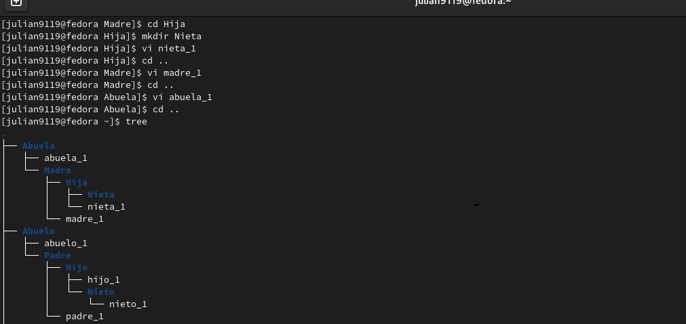
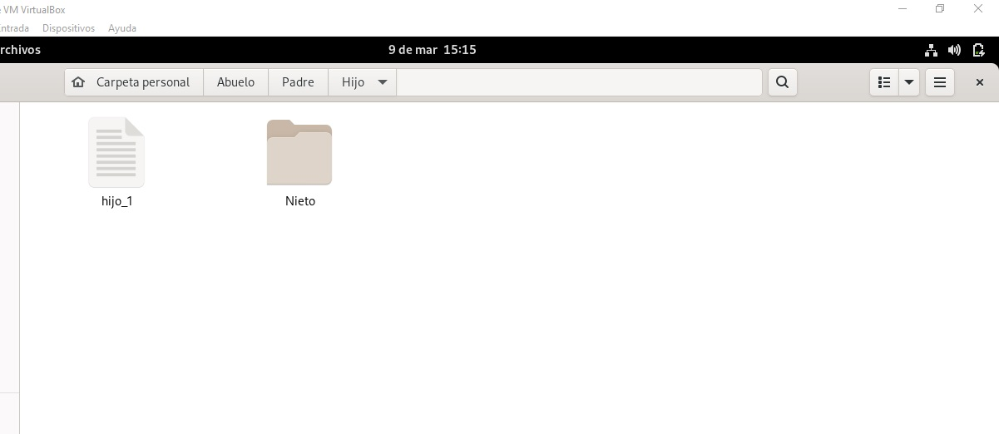
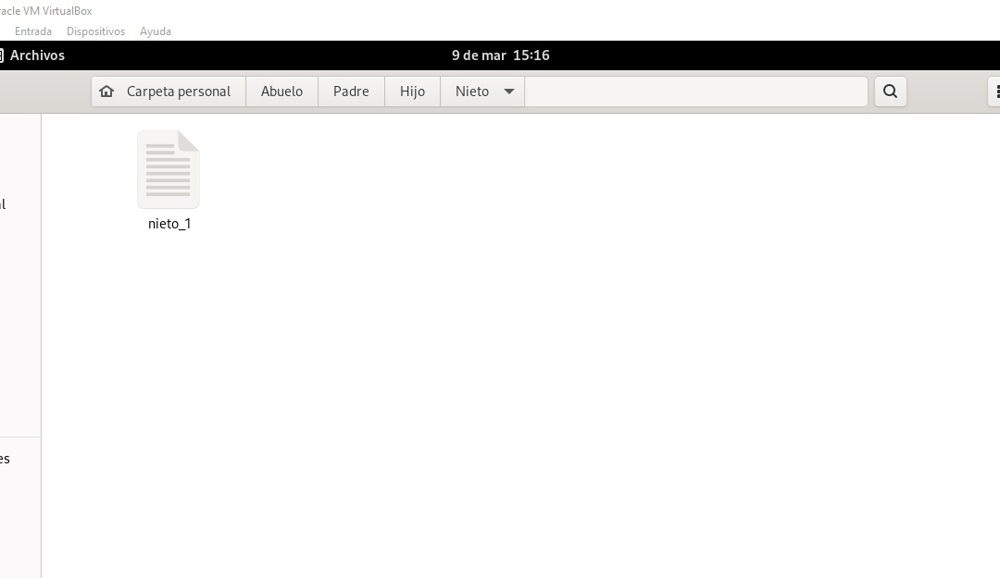

<h1 align="center">       Taller 1 Linux 1 </h1>

<h3 align="center">Nombre Julián David Hernández Torres  (Virtual Private Network)</h2>

<h3 align="center">Paso 1 listamos  el contenido del directorio con el comando  ls-a</h2>

<h3 align="center">Paso 2  escribimos el comando cd  hasta llegar  a  la raíz y volvemos  aplicar  el comando  ls -a ls-a</h2>

<h3 align="center"> Comenzamos a crear las capetas desde abuelo hasta el último que es el nieto  para  luego  crear  el  primer archivo   e irnos devolviendo con el  comando cd ..   e ir creando cada archivo en la carpeta correspondiente</h2>

<h3 align="center"> Paso 4  Comenzamos a llenar los datos en cada archivo con el comando vi">

<h3 align="center">Paso 6 Instalamos el paquete `tree` lo ejecutarmos en el directorio del usuario">

<h3 align="center">Paso7  Verificamos que los directorios y archivos estén correctamente creados.">

