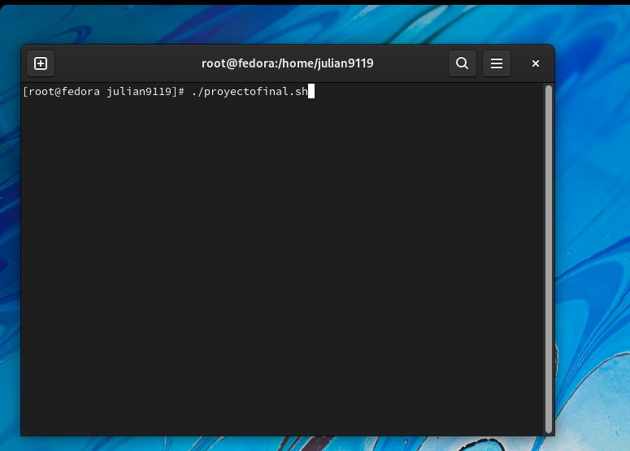
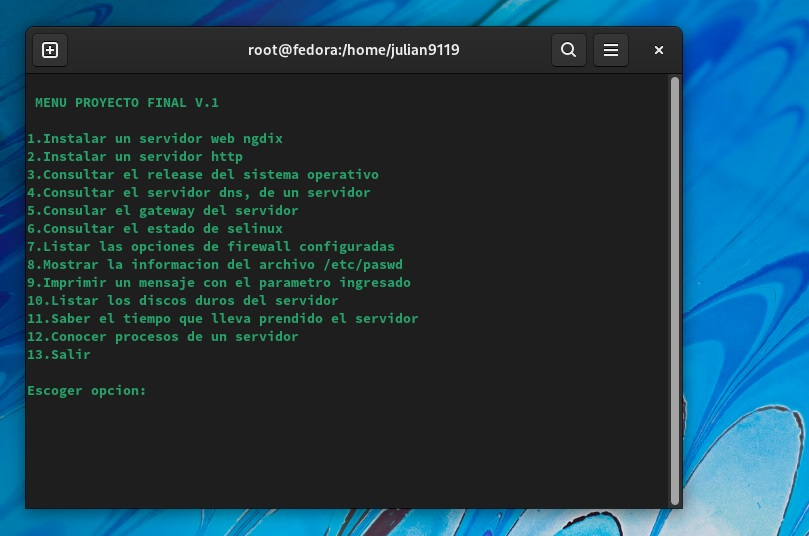

<h1 align="center">       Proyecto Final Linux 1 </h1>

<h3 align="center">Nombre Julián David Hernández Torres  (Virtual Private Network)</h2>
<h1 align="center"> 1.  Iniciamos  nuestro script de proyecto final con el comando ./proyectofinal.sh  </h1>

<h1 align="center"> 2.  Despues se inicia el un menu con todas las opciones de los puntos que pide el proyecto final</h1>

<h1 align="center"> El scritp fue  enviado al classroom en la tarea que puso el profesor el 03/06/2022 para ser sustentado en clase segun lo acordado con el profesor muchas gracias</h1>
