<h1 align="center">       Taller 2 Linux 1 </h1>

<h3 align="center">Nombre Julián David Hernández Torres  (Virtual Private Network)</h2>

<h3 align="center"Hacemos comando ls para listar  los directorios</h2>

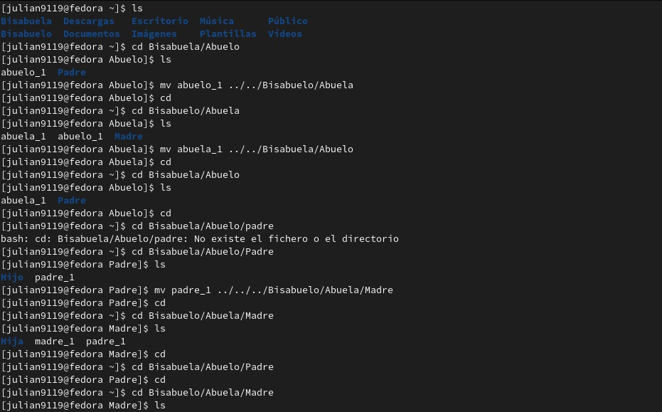

<h3 align="center">Comenzamos pasando los archivos  de  la capeta abuelo a abuela y  del mismo modo con la carpeta  abuela
ls mv abuelo_1 ../../Bisabuelo/Abuela cd</h2>
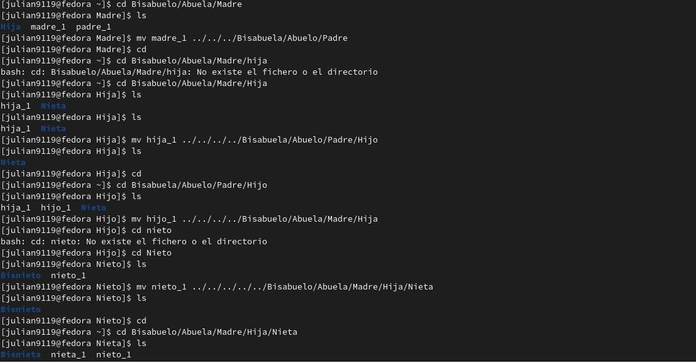
<h3 align="center">En la siguiente imagen se ve todos los pasos que hicimos para mover las carpetas de masculinos femeninos</h2>
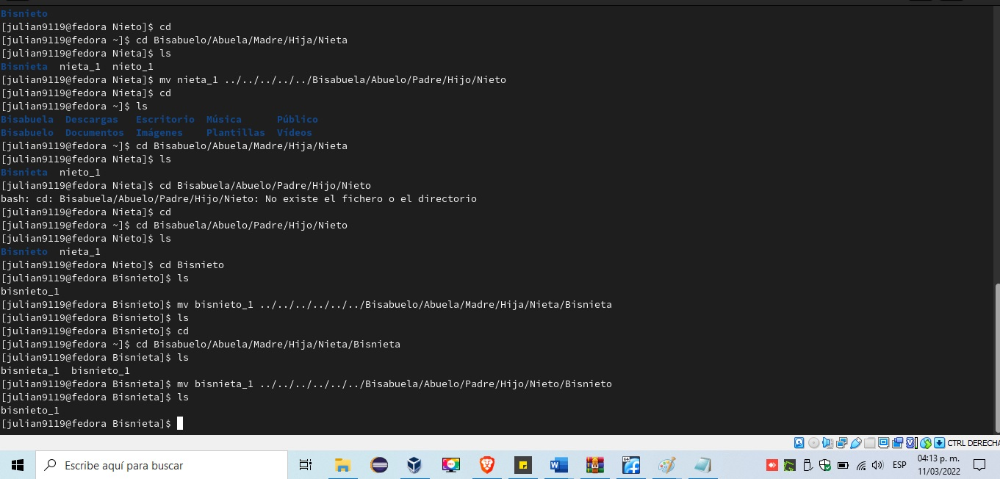

<h3 align="center"> Segimos con la parte 2  siguiendo los pasos y los codigos para cambiar la contraseña de un usuario, lo primero es entrar oprimiendo el boton e </h2 >
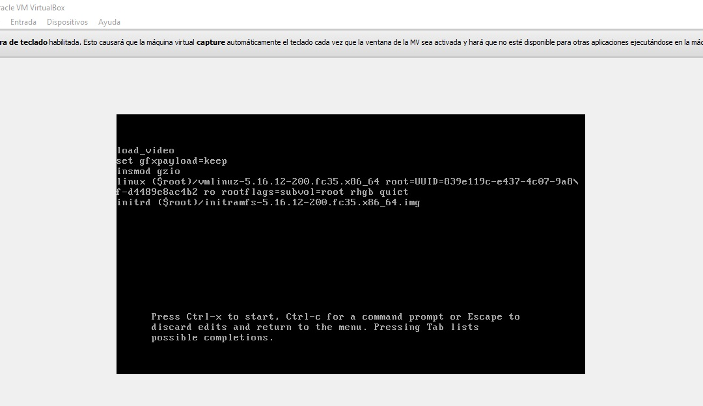

<h3 align="center"> En la siguiente imagen se evidencia que hemos cambiado la linea 16 con rd.break </h2>
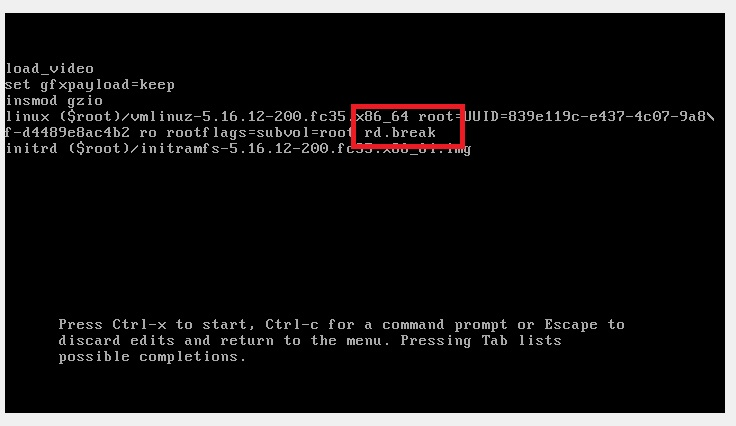
<h3 align="center"> Entramos por consola</h2>
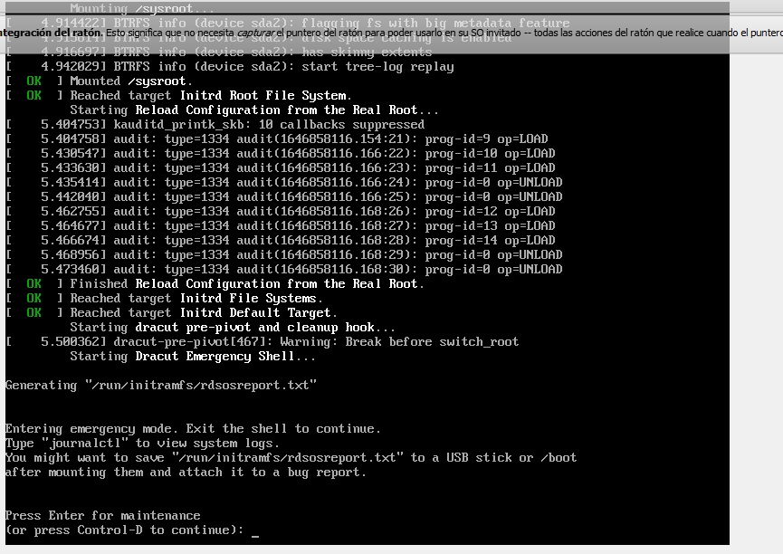
<h3 align="center">Escribimos el comando mount -o rw.remount /Sysroot/</h2>
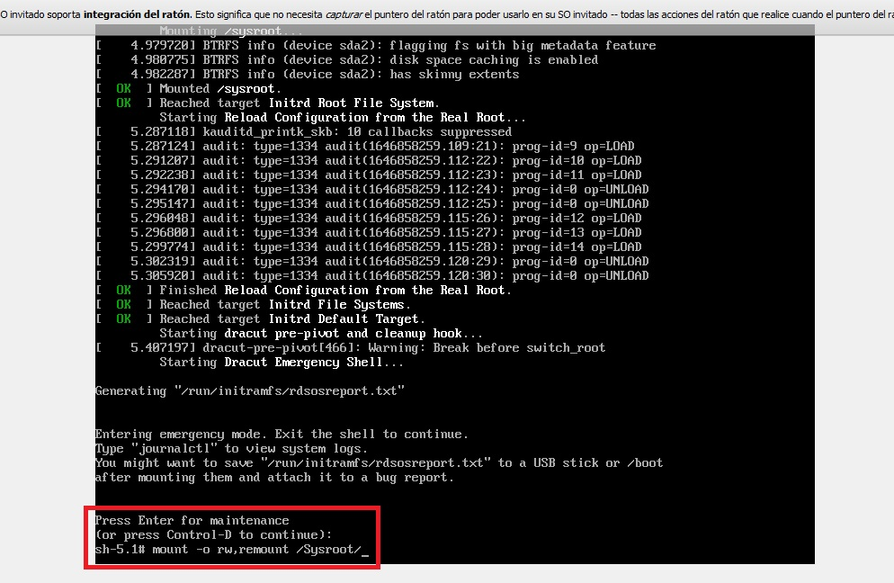
<h3 align="center">Cambiamos la contraseña del usuario /Sysroot/</h2>
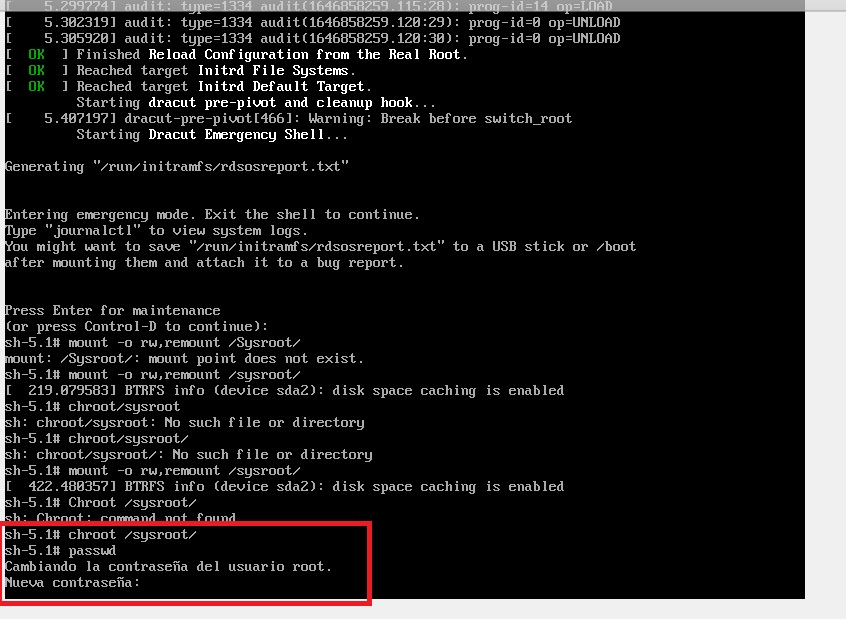
<h3 align="center">Volvemos a escribir la nueva contraseña/Sysroot/</h2>
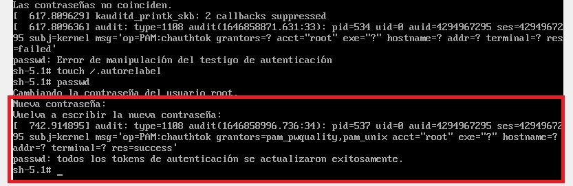
h3 align="center">Escribimos el comando touch /.autorelabel</h2>
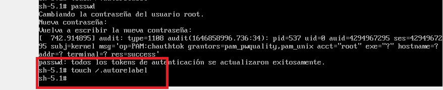
h3 align="center">Oprimimos enter y esperamos</h2>
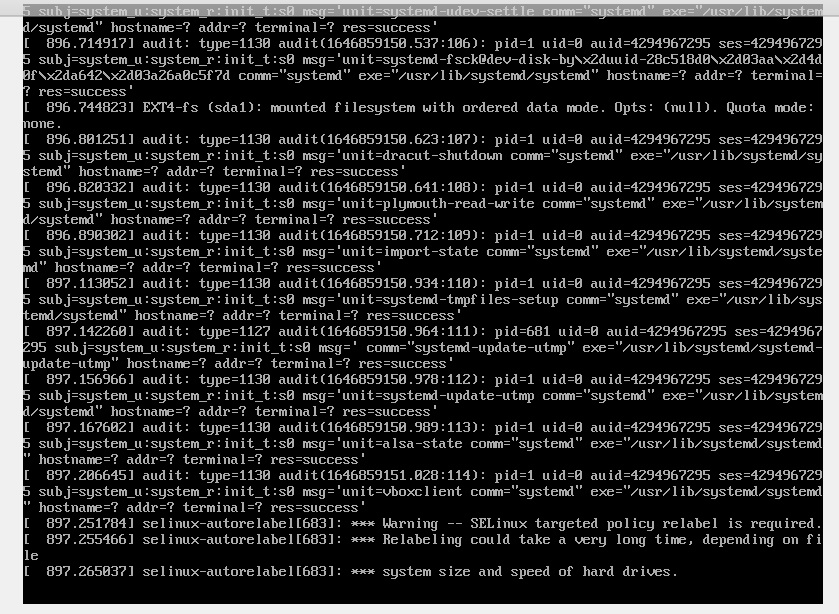