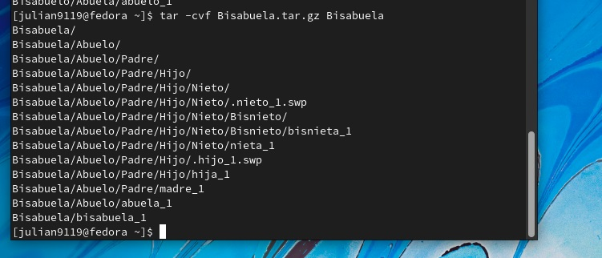

<h1 align="center">       Taller 3 Linux 1 </h1>

<h3 align="center">Nombre Julián David Hernández Torres  (Virtual Private Network)</h2>

<h3 align="center">Escribimos el comando pwd  para saber la ruta donde estamos ubicados y luego  el comando ls
Posteriormente escribimos el comando para comprimir la carpeta tar </h2>

<h3 align="center">Usamos el comando tar  -cvf Bisabuelo.tar .gz Bisabuelo</h2>

<h3 align="center">Usamos el comando tar  -cvf Bisabuela.tar .gz Bisabuela</h2>

<h3 align="center"> Usamos el comando tar  -cvf Bisabuelo.tar .bz2 Bisabuelo </h2 >

<h3 align="center"> Usamos el comando tar  -cvf Bisabuelo.tar .bz2 Bisabuela </h2 >
 
<h1 align="center">       2.listar los archivos comprimidos </h1>
<h3 align="center"> Escribimos el comando tar -tvf Bisabuelo.tar</h2>

<h3 align="center"> Escribimos el comando tar -tvf Bisabuela.tar</h2>

<h3 align="center">Escribimos el comando tar -tvf Bisabuelo.tar.gz</h2>

<h1 align="center"> 3. Descomprimir los directorios bisabuelo en las siguientes rutas -c ../../imp/ </h1>
<h3 align="center">Usamos el comando tar -xvf Bisabuelo.tar -c ../../ y asi con todos los archivos comprimidos anteriormente con su extencion</h2>

<h3 align="center">Por ultimos confirmamos que este punto todos los archivos esten descomprimidos con los directorios  bisabuelo y bisabuela</h2>

<h1 align="center"> 4. comprimimos direcctorios usando zip,unzi </h1>
<h3 align="center">Usamos los comandos zip Bisabuelo.zip Bisabuelo y luego ls para listar  y compro bar</h2>

