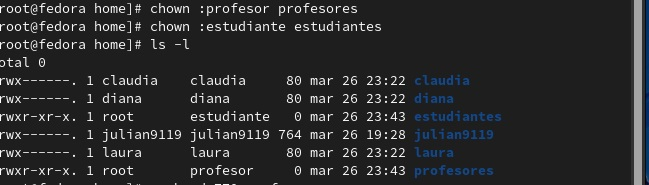
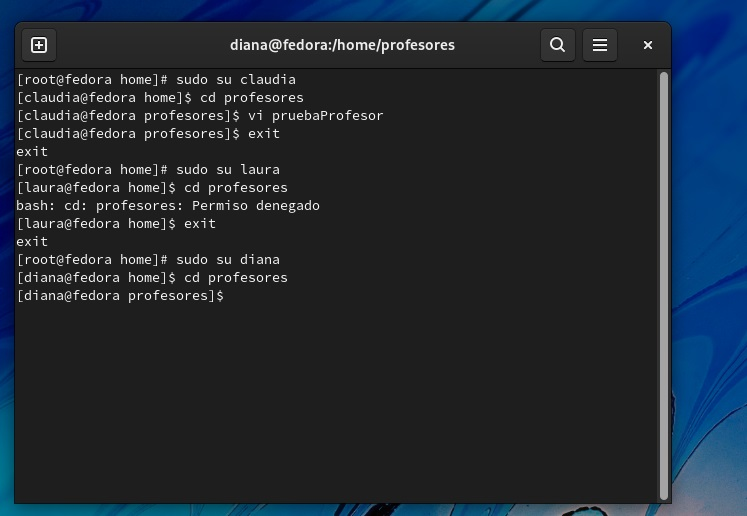
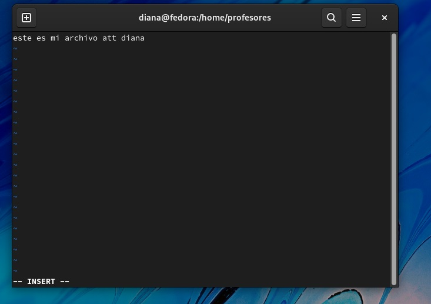

<h1 align="center">       Taller 4 Linux 1 </h1>

<h3 align="center">Nombre Julián David Hernández Torres  (Virtual Private Network)</h2>
<h1 align="center"> 1.  Crear dos grupos llamados: profesor,  estudiante </h1>
<h3 align="center">primero accedemos como super usuario con el comando sudo -s y escribimos la contraseña </h2>
<h3 align="center">luego usamos el comando groupadd -r profesor && groupadd -r estudiante 
posteriormente usamos pwd para saber la ruta donde nos encontramos y luego retrocedemos dos veces atras con cd
 </h2>

<h3 align="center">listamos para verificar que esten creados los grupos</h2>
<h1 align="center"> 2.  Crear tres usuarios llamados:  diana,  claudia y laura </h1>

<h3 align="center">creamos 3 usuarios usando el comando usaradd diana && user add claudia && useradd laura y posteriormente listamos y confirmaomos si fueron creados con
el comando cat etc /passwd  y miramos si estan en el listado</h2>

<h1 align="center"> 3.    Conociendo que:  diana  es un profesor;  laura es una estudiante   yclaudia   es un  profesor   y un   estudiante.
Adicione  todos los usuarios a los grupos correspondientes </h1>
<h3 align="center"> Añadimos a los usuarios creados anteriormente en los grupos correspondiente usando los siguientes comandos
usermod -g profesor diana
usermod -g estudiante laura
como claudia es un profesor y un estudiante usamos el siguiente comando con las banderas -a y -G  
usermod -a -G estudiante claudia
usermod -a -G profesor Claudia
Posteriormente usamos el comando groups para  verificar que los usuarios este añadidos correctamente
 </h2 >

<h1 align="center"> 4. Cree dos directorios, uno para profesores (solo los profesores tienen acceso) y otro para estudiantes 
(profesores y estudiantes tienen acceso).   Asegúrese de asignar los permisos.</h1>
<h3 align="center"> Nos regresamos a la ruta cd home/
y creamos los directorios usando los comandos
mkdir profesores
mkdis estudiantes
 </h2 >
 
<h3 align="center"> con el comando 'ls -l' con el fin de listar los direcctorios y ver sus permisos observamos que el root
tiene los permisos sobre estos directorios </h2 >

<h3 align="center"> Una ves creado los directorios tenemos que darle permiso a los directorios para que los grupos estudiante y profesor puedan
modificar en cada direcctorio correspondiente esto se logra de dos formas con el comando 'chgrp + nombre del grupo + el nombre del directorio' </h2>
<h3 align="center"> La otra forma es con 'chown + nombre del grupo + nombre del direcctorio' usaremos esta forma </h2>
<h3 align="center"> Por ultimo escribimos el comando 'ls -l' y verificamos que los grupos estudiantey profesor
tambien tienen permisos sobre estos directorios </h2>

<h3 align="center"> luego de tedremos que gestionar los permisos necesarios para que los usuarios
puedan ingresar a las carpetas 770 para los profesores y 777 para los estudiantes debido a que en el
enunciado indica que todos los usuarios pueden ingresar al directorio estudiantes  </h2>
<h3 align="center"> Usamos el comando 'chmod + la combinacion de permisos a usar'</h2>

<h1 align="center"> 5. Verifique los permisos anteriores, usando las cuentas de los usuarios ya creados</h1>
<h3 align="center"> Verificamos los permisos logueandonos con diferentes usuarios y tratando de ingresar a los direcctorios.
 En la siguiente imagen se aprecia que Claudia y Diana tienen ingreso al directorio profesores por que pertenecen al grupo profesor
pero laura no por que pertenece al grupo estudiante</h2>

<h1 align="center"> 6. Use un editor de texto para crear archivos en los respectivos directorios, usando diferentes usuarios.</h1>

 <h1 align="center"> 7.Como super usuario, cambie de dueño los archivos creados</h1>
<h3 align="center"> Usamos el comando chown+nombre usuario+ nombre del archivo del usuario a cambiar /h2>
<h3 align="center"> listamos con el comando ls -l para verificar los permisos</h2>
<h3 align="center"> cambiamos los permisos de claudia a diana y luego de claudia a diana como se puede ver en la imagen>

 <h1 align="center"> 8.Usando diferentes terminales, entre al sistema con los diferentes usuarios:</h1>

 <h1 align="center"> 9.Usando diferentes terminales, entre al sistema con los diferentes usuarios:equivoquese algunas veces en las claves o en el nombre de usuario):</h1>

 <h1 align="center"> 10.Determine la cantidad de veces que el estudiante laura ingreso al sistema.</h1>

 <h1 align="center"> 11.Comprima el contenidos del directorio de los profesores en profesore.tgz y 
el contenido del directorio de los estudiante en un archivo estudiantes.zip.</h1>

 <h1 align="center"> 12Cree un alias para cambiar la clave del usuario diana.</h1>
