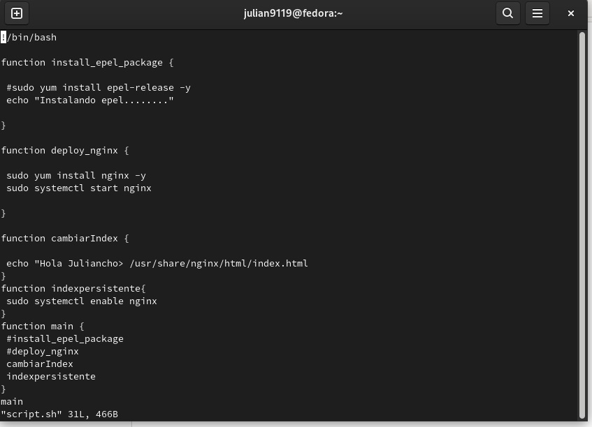

<h1 align="center">       Taller 5 Linux 1 </h1>

<h3 align="center">Nombre Julián David Hernández Torres  (Virtual Private Network)</h2>
<h1 align="center"> 1. Creamos nuestro primer archivo  el scrit con el siguiente codigo: </h1>
<h3 align="center">#!/bin/bash 
 
function install_epel_package { 
 
 #sudo yum install epel-release -y 
 echo "Instalando epel........" 
 
} 
 
function deploy_nginx { 
 
 sudo yum install nginx -y 
 sudo systemctl start nginx 
 
} 
 
function cambiarIndex { 
 
 echo "Hola Juliancho> /usr/share/nginx/html/index.html 
} 
function indexpersistente{ 
 sudo systemctl enable nginx 
} 
function main { 
 #install_epel_package 
 #deploy_nginx 
 cambiarIndex 
 indexpersistente 
} 
main </h2>

