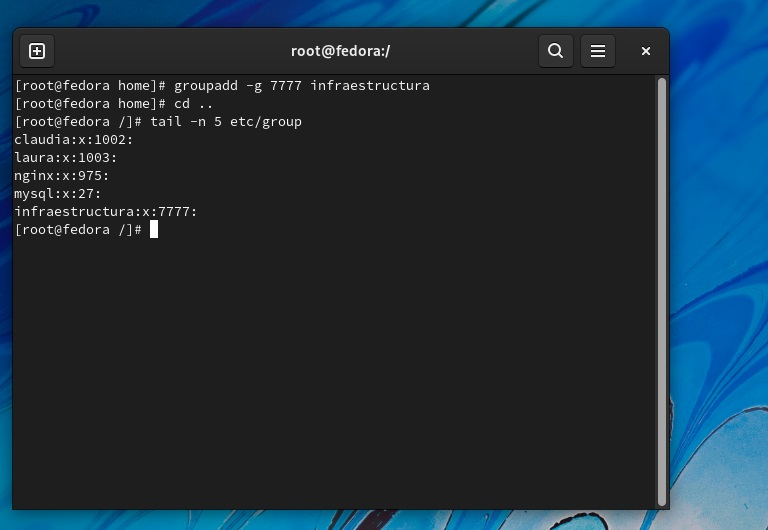
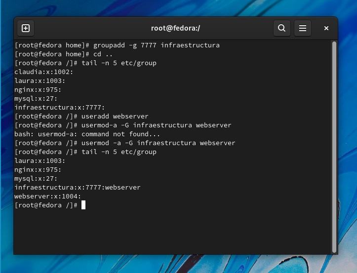
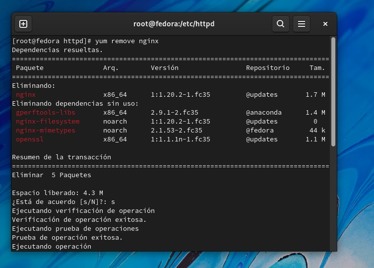
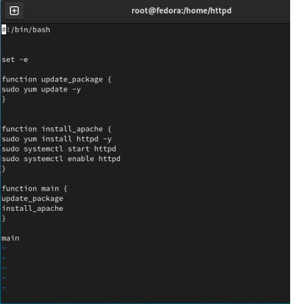

<h1 align="center">       Taller 6 Linux 1 </h1>

<h3 align="center">Nombre Julián David Hernández Torres  (Virtual Private Network)</h2>
<h1 align="center"> 1.  ejecutamos el comando groupadd -g 7777 infractructura  </h1>
<h3 align="center">primero accedemos como super usuario con el comando sudo -s y escribimos la contraseña </h2>
<h3 align="center">luego usamos el comando groupadd -r profesor && groupadd -r estudiante 
posteriormente usamos pwd para saber la ruta donde nos encontramos y luego retrocedemos dos veces atras con cd
 </h2>

<h3 align="center">listamos para verificar que esten creados los grupos</h2>
<h1 align="center"> 2.  Creamos el usuario llamado webserver que perteneza al grupo ejecuntando el comando usermod -a -G  infraestructura </h1>

<h1 align="center"> 3.  Detenemos el servicio nginx </h1>

<h1 align="center"> 4.  usamos el Script anterior y cambiamos el paquete nginx</h1>

<h1 align="center"> 5.  Verificamos que funcione el despliegue</h1>