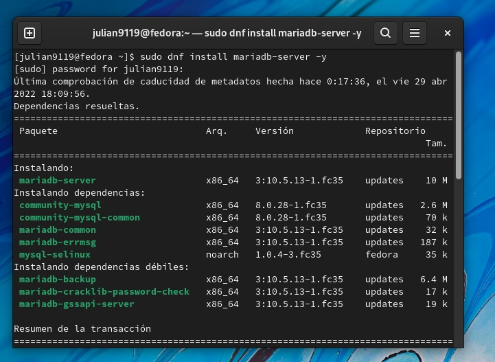
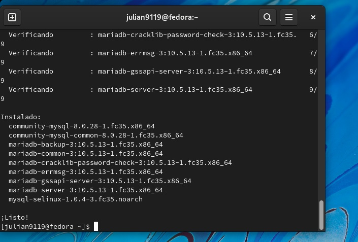
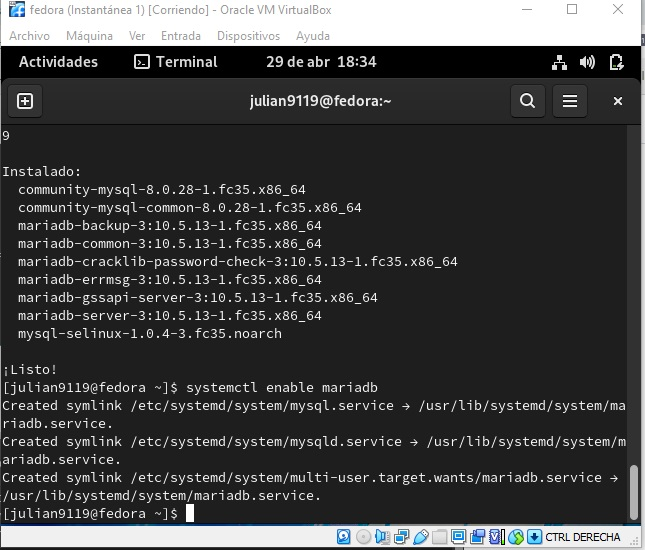
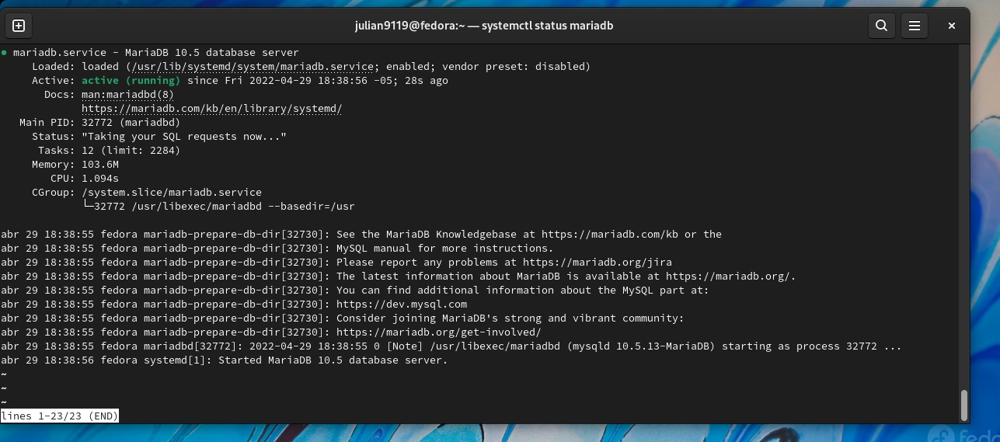
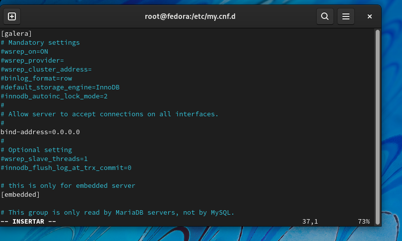
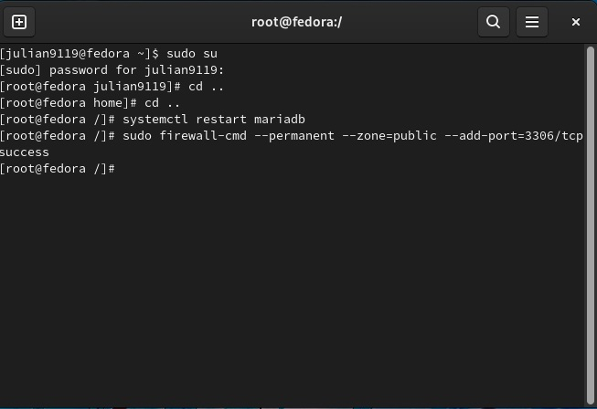

<h1 align="center">       Taller 7 Linux 1 </h1>

<h3 align="center">Nombre Julián David Hernández Torres  (Virtual Private Network)</h2>
<h1 align="center"> 1.  Instalamos maria db usando el comando sudo dnf install maria db-server-y  </h1>

<h1 align="center"> 2.  Despues se inicia el servicio de la base de datos mediante el comando systemctl star maria db y luego la opcion enable para la persistencia systemctl enable mariadb</h1>

<h1 align="center"> Luego comprobamos lo anterior mediante el comando systemctl status mariadb </h1>

<h1 align="center"> Luego configuramos la maquina princial que vamos usar para que permita hacer concexiones remotas</h1>

<h1 align="center"> Verificamos que funcione el despliegue</h1>

<h1 align="center"> Verificamos que funcione el despliegue</h1>
<img src="./7.jpg"